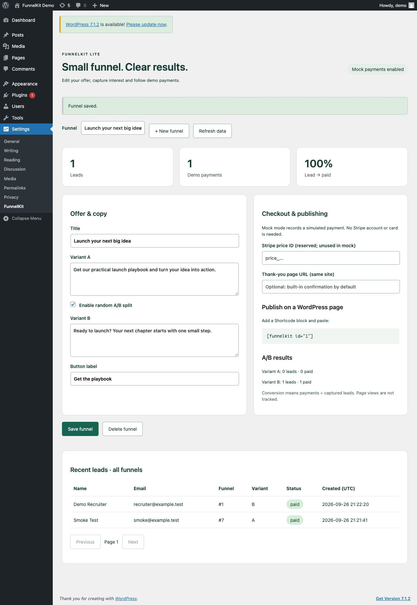
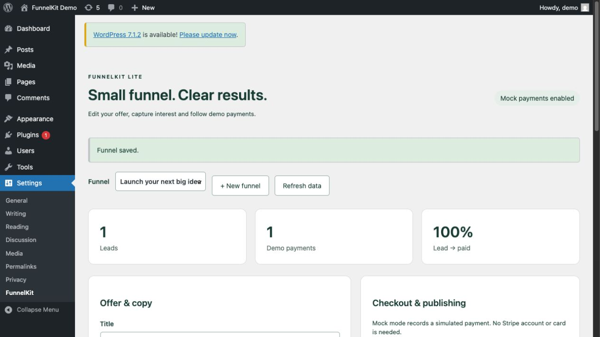
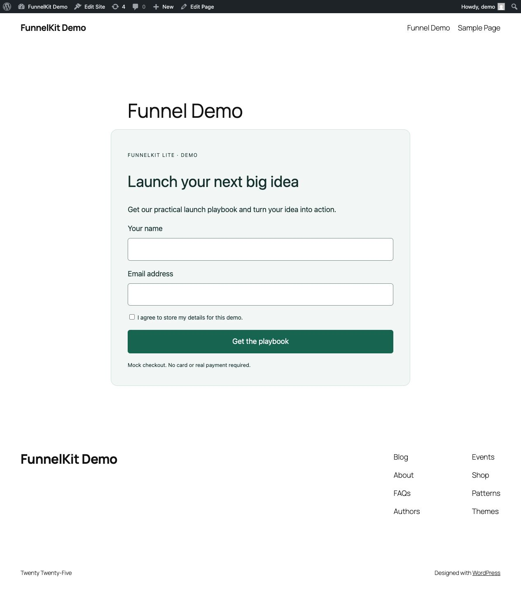

# FunnelKit Lite

FunnelKit Lite is a small WordPress 6.x plugin (minimum WordPress 6.6; the Compose demo is tested on 6.8) demonstrating a complete sales-funnel path: PHP shortcode, consented lead capture, React 18 + TypeScript settings, A/B copy, conversion metrics, and offline mock checkout. It is an MVP portfolio project, not a WooCommerce replacement or Elementor add-on.

## Public demo

No public demo is currently available. This is a WordPress plugin demonstrated through the local Docker Compose environment below.


## Five-minute recruiter demo

Requirements: Docker Desktop (or compatible Docker Compose) and Node.js/npm for source builds. PHP/Composer are optional: run the PHP suite in the documented Composer/PHPUnit container when they are unavailable on the host.

```sh
npm ci
npm run build
sh scripts/setup.sh
```

Open [http://localhost:8080](http://localhost:8080), sign in as `demo` / `local-demo-change-me`, and open **Settings → FunnelKit**. Edit the offer, enable/disable the random A/B split, and save. Setup creates the page containing `[funnelkit id="1"]`; use [http://localhost:8080/?pagename=funnel-demo](http://localhost:8080/?pagename=funnel-demo) for a plain-permalink-safe URL (a fresh install may also show `/?page_id=4`).

Submit the public form with consent. The mock checkout records a lead without a card or Stripe account; click **Simulate successful payment**. Return to the admin page to see leads, paid counts, conversion rate, and per-variant results. The smoke script exercises the same flow automatically.

Stop with `docker compose down`; add `-v` only to intentionally remove local WordPress/MySQL volumes.

## Local environment

`compose.yaml` uses WordPress `6.8-php8.2-apache` and MySQL `8.0`, maps the plugin into `/var/www/html/wp-content/plugins/funnelkit-lite`, and exposes WordPress on `127.0.0.1:8080`. Demo admin: `demo` / `local-demo-change-me`. Local webhook secret: `local-demo-webhook-secret-change-me`; do not reuse these values outside the disposable demo.

`scripts/setup.sh` starts Compose, waits for WP-CLI, installs WordPress if needed, activates the plugin, and creates the demo page. `scripts/smoke.py` defaults to `http://localhost:8080`; override `WP_URL`, `WP_USER`, `WP_PASSWORD`, or `FUNNELKIT_WEBHOOK_SECRET` for another local instance.

## Build, test, smoke, and package commands

```sh
npm ci
npm run build
npm run typecheck
npm test
python3 scripts/smoke.py
npm run zip
sh scripts/verify-zip.sh
```

`npm test` runs Jest through `wp-scripts`. The Docker-only PHPUnit path is `docker run --rm -v "$PWD:/app" composer:2 install --ignore-platform-reqs`, followed by `docker compose exec -T wordpress php /var/www/html/wp-content/plugins/funnelkit-lite/vendor/bin/phpunit -c /var/www/html/wp-content/plugins/funnelkit-lite/phpunit.xml`. A host with PHP/Composer can use `composer install && composer test`. `scripts/verify-zip.sh` verifies ZIP installation/activation and uninstall cleanup against the running demo using the reserved `fkziptest_` database prefix; run it after `sh scripts/setup.sh`. The distributable zip includes built `build/` assets and PHP files, so an installing WordPress site needs no Node.js/npm.

## Architecture

`funnelkit-lite.php` is the plugin entry point. `includes/class-plugin.php` owns hooks, REST controllers, shortcode rendering, form handling, mock checkout, and webhook verification. `includes/class-store.php` owns funnel options and the `$wpdb` lead table. `src/` contains the React admin UI and metric helper; compiled output is in `build/`. `assets/public.css` styles the public shortcode. `uninstall.php` performs cleanup.

The public surface is a shortcode, not a custom Gutenberg block: add a **Shortcode** block (or classic editor shortcode) containing `[funnelkit id="1"]`. The admin bundle uses the React runtime supplied by WordPress; React 18 is a development dependency for the build. A/B selection is random per rendered request. Disable/bypass full-page caching for shortcode pages when measuring variants; page views are not tracked.

`price_id` is reserved for a future Stripe integration and unused in mock mode. The mock checkout stores only a SHA-256 hash of its unguessable bearer token. Webhook JSON is `{"type":"mock.checkout.completed","token":"<64-hex-token>"}` and requires `X-FunnelKit-Timestamp` plus `X-FunnelKit-Signature`. The signature is `HMAC-SHA256(secret, timestamp + "." + exact_request_body)`; timestamps older than five minutes are rejected. Duplicate delivery is safe.

## REST API

Routes are under `/wp-json/funnelkit/v1/` (or `/?rest_route=/funnelkit/v1/...`). CRUD and reporting require a logged-in user with `manage_options`; the React app uses a WordPress REST nonce.

| Method | Route | Purpose |
|---|---|---|
| GET | `/funnels` | List funnel configurations |
| POST | `/funnels` | Create a funnel |
| GET | `/funnels/{id}` | Read one funnel |
| PUT | `/funnels/{id}` | Update one funnel |
| DELETE | `/funnels/{id}` | Delete one funnel configuration |
| GET | `/leads?page=1` | List up to 50 recent leads per page |
| GET | `/metrics` | Leads and paid totals grouped by funnel and variant |
| POST | `/webhook` | Verify signed mock completion and mark a lead paid |

The public form uses WordPress nonces and validates name, email, and consent. Thank-you URLs must be HTTP(S) URLs on the same site.

## Installation from a zip

Run `npm run build` and `npm run zip`, then upload `dist/funnelkit-lite.zip` under **Plugins → Add New → Upload Plugin** (or copy the unzipped `funnelkit-lite` directory to `wp-content/plugins/`). Activate it, configure a funnel under **Settings → FunnelKit**, and place its shortcode on a page. Production Stripe credentials and real charging are outside this MVP.

## Privacy and deletion

The plugin stores submitted name, email, funnel/variant, status, timestamps, and a token hash in `{prefix}funnelkit_leads`. Consent is required. Deleting a funnel leaves existing leads intact. Deactivation preserves data. Uninstall removes the lead table and funnel options on the current site (and every site during multisite uninstall); this is permanent.

## Screenshots







## Known local limitations

Compose is for local demonstration only: demo credentials, local webhook secret, mock payments, and a source bind mount. Metrics are lead-to-paid counts by variant; page views and attribution are not collected. Production needs real secrets, HTTPS, a real Stripe integration, cache rules, and a privacy/export/retention policy.
